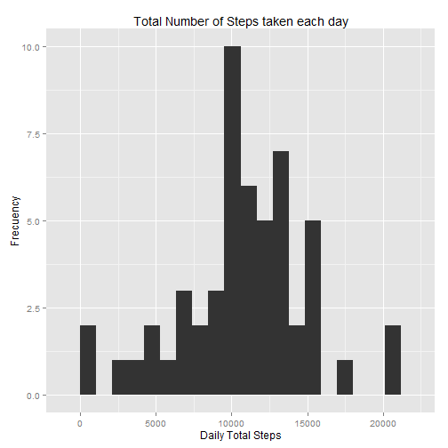
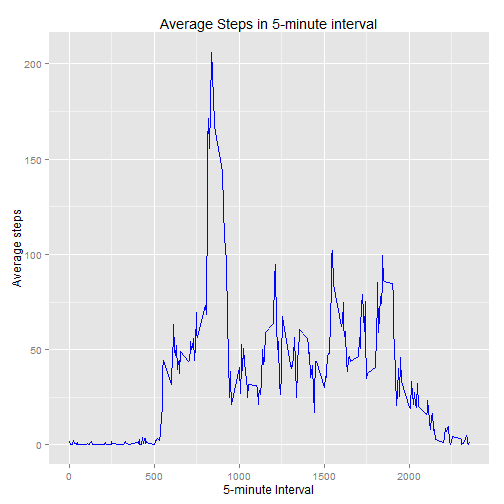
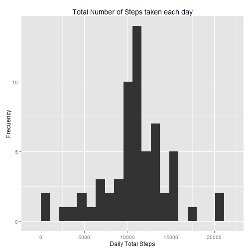
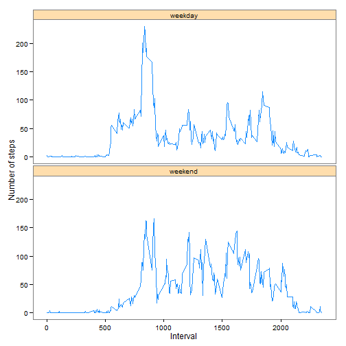

## Introduction

It is now possible to collect a large amount of data about personal
movement using activity monitoring devices such as a
[Fitbit](http://www.fitbit.com), [Nike
Fuelband](http://www.nike.com/us/en_us/c/nikeplus-fuelband), or
[Jawbone Up](https://jawbone.com/up). These type of devices are part of
the "quantified self" movement -- a group of enthusiasts who take
measurements about themselves regularly to improve their health, to
find patterns in their behavior, or because they are tech geeks. But
these data remain under-utilized both because the raw data are hard to
obtain and there is a lack of statistical methods and software for
processing and interpreting the data.

This assignment makes use of data from a personal activity monitoring
device. This device collects data at 5 minute intervals through out the
day. The data consists of two months of data from an anonymous
individual collected during the months of October and November, 2012
and include the number of steps taken in 5 minute intervals each day.

## Data

The data for this assignment can be downloaded from the course web
site:

* Dataset: [Activity monitoring data](https://d396qusza40orc.cloudfront.net/repdata%2Fdata%2Factivity.zip) [52K]

The variables included in this dataset are:

* **steps**: Number of steps taking in a 5-minute interval (missing
    values are coded as `NA`)

* **date**: The date on which the measurement was taken in YYYY-MM-DD
    format

* **interval**: Identifier for the 5-minute interval in which
    measurement was taken


The dataset is stored in a comma-separated-value (CSV) file and there
are a total of 17,568 observations in this
dataset.

### Preparing Environment

Loading Libraries


```r
library(dplyr)
library(ggplot2)
library(knitr)
```

Set options on RMarkdown


```r
opts_chunk$set(echo=TRUE)
```

Set enrironment to English for Days of the Week.


```r
Sys.setlocale("LC_TIME", "English")
```

```
## [1] "English_United States.1252"
```

### Loading and preprocessing the data

1. Load the data


```r
unzip("activity.zip")
activity <- read.csv("activity.csv")
summary(activity)
```

```
##      steps                date          interval     
##  Min.   :  0.00   2012-10-01:  288   Min.   :   0.0  
##  1st Qu.:  0.00   2012-10-02:  288   1st Qu.: 588.8  
##  Median :  0.00   2012-10-03:  288   Median :1177.5  
##  Mean   : 37.38   2012-10-04:  288   Mean   :1177.5  
##  3rd Qu.: 12.00   2012-10-05:  288   3rd Qu.:1766.2  
##  Max.   :806.00   2012-10-06:  288   Max.   :2355.0  
##  NA's   :2304     (Other)   :15840
```

2. Process/transform the data (if necessary) into a format suitable for your analysis


### What is mean total number of steps taken per day?

For this part of the assignment, you can ignore the missing values in
the dataset.

1. Make a histogram of the total number of steps taken each day


```r
group_date <- tapply(activity$step, activity$date, sum)
qplot(group_date, geom="histogram", binwidth=1060, xlab="Daily Total Steps", 
      main="Total Number of Steps taken each day", ylab="Frecuency")
```

 

2. Calculate and report the **mean** and **median** total number of steps taken per day


```r
mean_steps <- mean(group_date, na.rm=TRUE)
mean_steps
```

```
## [1] 10766.19
```

```r
median_steps <- median(group_date, na.rm=TRUE)
median_steps
```

```
## [1] 10765
```


### What is the average daily activity pattern?

1. Make a time series plot (i.e. `type = "l"`) of the 5-minute interval (x-axis) and the average number of steps taken, averaged across all days (y-axis)


```r
averagePerInterval <- aggregate(x = list(steps = activity$steps), by = list(interval = activity$interval), 
    FUN = mean, na.rm = TRUE)
ggplot(data = averagePerInterval, aes(x = interval, y = steps)) + geom_line(colour = "blue") + 
    xlab("5-minute Interval") + ylab("Average steps") + ggtitle("Average Steps in 5-minute interval")
```

 

2. Which 5-minute interval, on average across all the days in the dataset, contains the maximum number of steps?


```r
averagePerInterval[which.max(averagePerInterval$steps), ]
```

```
##     interval    steps
## 104      835 206.1698
```

The 835 interval in average, is the most active time with 206 steps.

### Imputing missing values

Note that there are a number of days/intervals where there are missing
values (coded as `NA`). The presence of missing days may introduce
bias into some calculations or summaries of the data.

1. Calculate and report the total number of missing values in the dataset (i.e. the total number of rows with `NA`s)


```r
summary(activity)
```

```
##      steps                date          interval     
##  Min.   :  0.00   2012-10-01:  288   Min.   :   0.0  
##  1st Qu.:  0.00   2012-10-02:  288   1st Qu.: 588.8  
##  Median :  0.00   2012-10-03:  288   Median :1177.5  
##  Mean   : 37.38   2012-10-04:  288   Mean   :1177.5  
##  3rd Qu.: 12.00   2012-10-05:  288   3rd Qu.:1766.2  
##  Max.   :806.00   2012-10-06:  288   Max.   :2355.0  
##  NA's   :2304     (Other)   :15840
```

We have 2304 observations (rows) without data (NA).

2. We can use the mean for the 5-minute interval to fill NA values on steps variable.


```r
activity2 <- activity
for (i in 1:nrow(activity2)) {
    if (is.na(activity2$steps[i])) { 
        activity2$steps[i] <- averagePerInterval$steps[averagePerInterval$interval == activity2$interval[i]]
    }
} 
```

3. Create a new dataset that is equal to the original dataset but with the missing data filled in.


```r
summary(activity2)
```

```
##      steps                date          interval     
##  Min.   :  0.00   2012-10-01:  288   Min.   :   0.0  
##  1st Qu.:  0.00   2012-10-02:  288   1st Qu.: 588.8  
##  Median :  0.00   2012-10-03:  288   Median :1177.5  
##  Mean   : 37.38   2012-10-04:  288   Mean   :1177.5  
##  3rd Qu.: 27.00   2012-10-05:  288   3rd Qu.:1766.2  
##  Max.   :806.00   2012-10-06:  288   Max.   :2355.0  
##                   (Other)   :15840
```

4. Make a histogram of the total number of steps taken each day and Calculate and report the **mean** and **median** total number of steps taken per day. Do these values differ from the estimates from the first part of the assignment? What is the impact of imputing missing data on the estimates of the total daily number of steps?


```r
group_date2 <- tapply(activity2$step, activity2$date, sum)
qplot(group_date2, geom="histogram", binwidth=1060, xlab="Daily Total Steps", 
      main="Total Number of Steps taken each day", ylab="Frecuency")
```

 

```r
mean_steps2 <- mean(group_date2)
mean_steps2
```

```
## [1] 10766.19
```

```r
median_steps2 <- median(group_date2)
median_steps2
```

```
## [1] 10766.19
```

We can see that mean remains the same, because we use the averages on the imputting missing task. But, the Histogram changed with a higher value on the mean, because we have more data with the mean value.

### Are there differences in activity patterns between weekdays and weekends?

For this part the `weekdays()` function may be of some help here. Use
the dataset with the filled-in missing values for this part.

1. Create a new factor variable in the dataset with two levels -- "weekday" and "weekend" indicating whether a given date is a weekday or weekend day.


```r
activity2$date <- as.Date(activity2$date)
activity2$WeekDay<-ifelse((weekdays(activity2$date) %in% c("Saturday","Sunday")), "weekend","weekday")
```

2. Make a panel plot containing a time series plot (i.e. `type = "l"`) of the 5-minute interval (x-axis) and the average number of steps taken, averaged across all weekday days or weekend days (y-axis). 


```r
activityByInterval<-group_by(activity2,WeekDay,interval)
meanWeekDay<-activity2 %>% group_by(WeekDay,interval) %>% summarize(mean_steps=mean(steps))
ggplot(meanWeekDay, aes(x=interval, y=mean_steps)) + 
  geom_line(color="dodgerblue") + facet_wrap(~ WeekDay, nrow=2, ncol=1) +
  labs(x="Interval", y="Number of steps") + theme_bw() + 
  theme(strip.background = element_rect(fill = "navajowhite"), panel.grid.major = element_blank(), 
  panel.grid.minor = element_blank())
```

 
